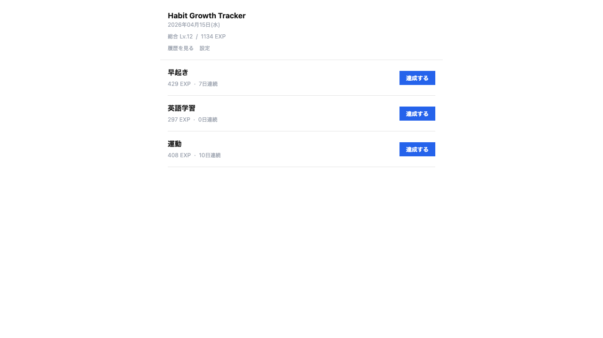
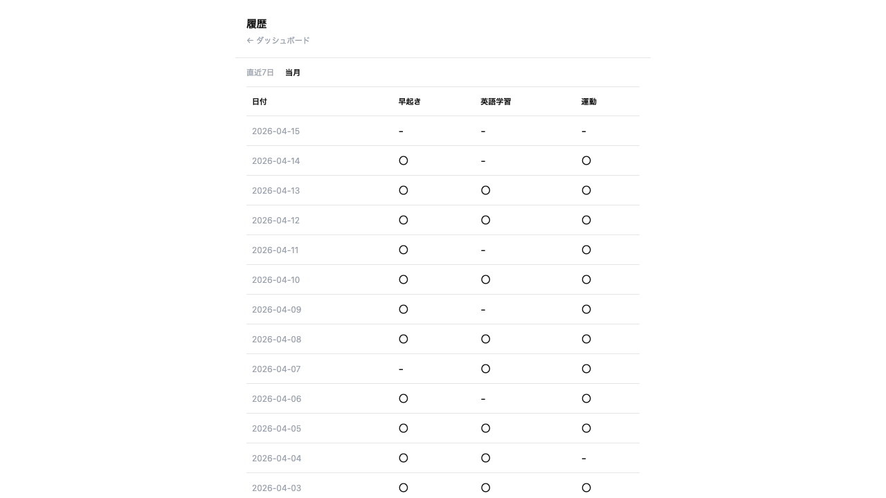
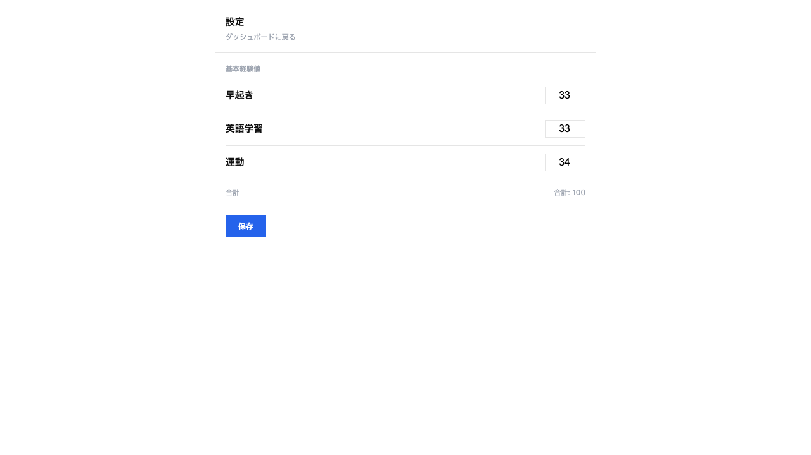

# Habit Growth Tracker

習慣の達成を毎日記録し、経験値・レベル・連続日数でゲーム感覚に可視化する Web アプリ。

## スクリーンショット

### ダッシュボード



### 履歴



### 設定



## 技術スタック

| カテゴリ | 技術 |
|---------|------|
| 言語 | Go |
| Web サーバ | net/http（標準ライブラリ） |
| テンプレート | html/template |
| DB | SQLite |
| DB アクセス | database/sql |
| フロントエンド | HTML / CSS |
| コンテナ | Docker（マルチステージビルド） |

## アーキテクチャ

handler → service → repository のレイヤードアーキテクチャを採用。各層はインターフェースで結合し、テスタビリティを確保している。

```text
habit-game/
├── cmd/app/main.go          # エントリポイント
├── internal/
│   ├── handler/             # HTTP ハンドラ（ルーティング・リクエスト処理）
│   ├── service/             # ビジネスロジック（EXP計算・ストリーク算出）
│   ├── repository/          # DB アクセス（SQLite操作）
│   ├── model/               # データ構造
│   └── db/                  # DB 接続・マイグレーション
├── templates/               # HTML テンプレート
├── migrations/              # SQL マイグレーションファイル
├── Dockerfile
└── docker-compose.yml
```

## セットアップ

```bash
# 開発サーバを起動（ホットリロード対応）
docker compose --profile dev up watch

# ブラウザで http://localhost:8080 にアクセス
```

## テスト

```bash
# 全テスト実行
go test ./...

# カバレッジ確認
go test -cover ./...
```
